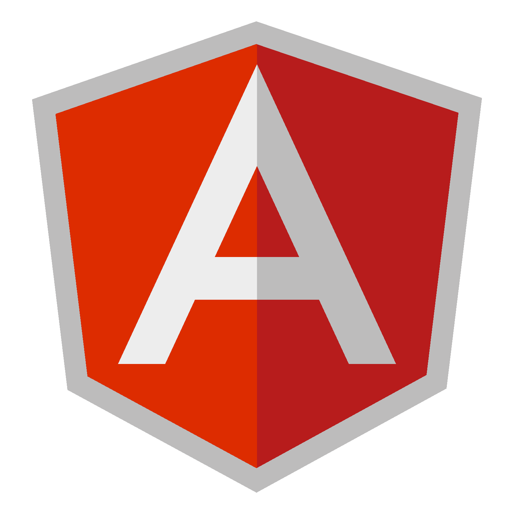
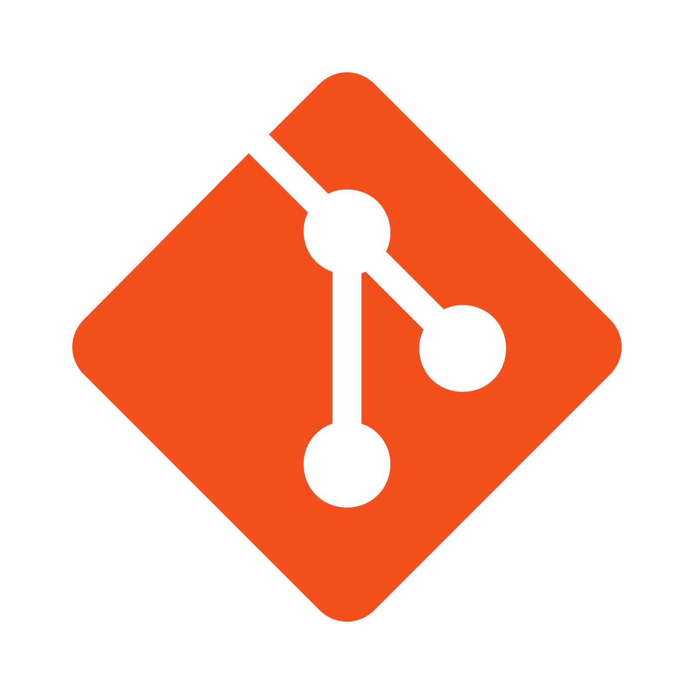

# 💻 Skill
  

[)]([https://www.linkedin.com/](https://es.linkedin.com/in/rafael-hanek-9bb986bb))

## Languages

  
  
  
  
  

## Databases

  
  

## Dev Tools

  
  <img  height="38" alingn="left" src="
